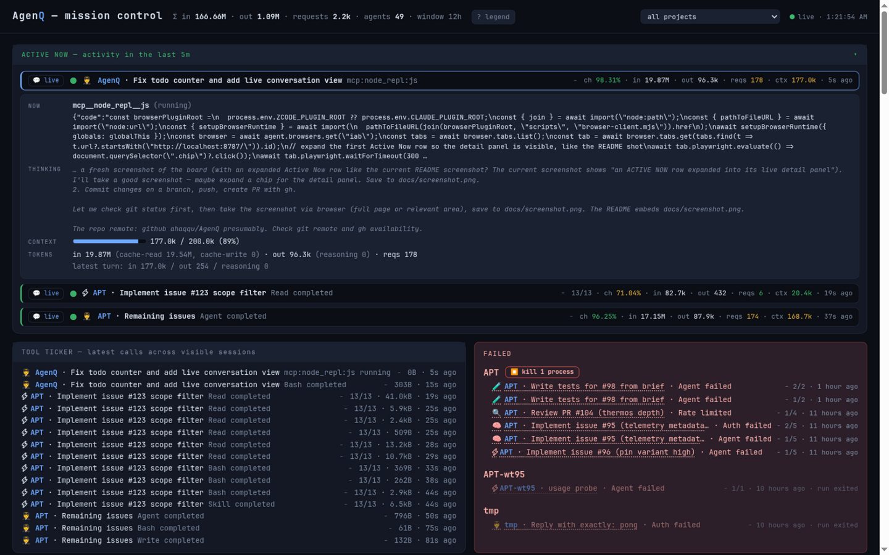

# AgenQ

Live mission-control monitor for [ZCode](https://github.com/ahaqqu) main sessions and subagents — because watching a manager run should be less boring than waiting for it. 🚀

AgenQ reads (read-only) the telemetry ZCode already writes on disk and turns it into a live board:



- **Agent tree** — the manager session with every dispatched subagent under it (role, model, live status)
- **Token-burn sparklines** — input tokens per request per agent, with a dashed marker at the 200K context cliff (the cliff that cost 36M tokens in the run that motivated this tool — see ahaqqu/agentic-project-template#94)
- **Live todos** — each agent's todo list, animated as it progresses
- **Active Now strip** — every session with a heartbeat in the last 5m; click a row to expand it into a live detail panel: the current tool call with its actual arguments, the latest thinking excerpt, todo progress, diff summary, context-window fill, turn timings (duration, time-to-first-token, retries), a full token breakdown (cache read/write, reasoning) and recent errors
- **Live conversation** — the 💬 button on an Active Now row opens the session's full conversation in a new tab (user prompts, assistant replies, collapsed thinking, tool calls with status), streaming new messages as they happen
- **Tool ticker** — the latest tool calls across visible sessions
- **Failure alerts** — rate limits and crashed agents turn red the moment they happen; a hollow dot means the process already exited

## Run it

```bash
git clone https://github.com/ahaqqu/AgenQ && cd AgenQ
bun link            # one-time — installs the `agenq` command (expects ~/.bun/bin on PATH)
agenq               # → open http://localhost:8787 in your browser
agenq --port 8791   # different port, `--window-hours 48` etc. work the same
agenq               # already running? it restarts the instance on that port
```

No `bun link`? `bun start` runs the exact same thing without installing. If `agenq` isn't found after linking (e.g. bun managed by mise), symlink it yourself:

```bash
ln -s "$(pwd)/monitor.mjs" ~/.local/bin/agenq
```

Requires [Bun](https://bun.sh) ≥ 1.1 and a machine where ZCode has been used (it reads ZCode's local telemetry). No dependencies, no build step, no DB writes — the DB is opened `mode=ro` per poll and the agents dir is only ever read.

**The one exception:** the FAILED panel has a ⏹ *stop run* action, **at project level** — that is the real granularity of the mechanism, so it is the granularity of the button. ZCode runs each project's CLI session as `zcode-cli` processes working in the project directory; stop SIGTERMs all of them (the button and the confirm dialog say how many). Liveness comes from `/proc`, not the DB: a failure whose process is gone is shown dimmed as *run exited*, with no button. Stop asks for confirmation first, and the server binds `127.0.0.1` so it is unreachable from the network.

Flags:

```bash
bun monitor.mjs --port 8787 --window-hours 12 \
  --db ~/.zcode/cli/db/db.sqlite \
  --agents-dir ~/.zcode/cli/agents
```

## Where the data comes from

| Source | Used for |
|---|---|
| `~/.zcode/cli/db/db.sqlite` (`model_usage`, `tool_usage`, `todo`, `session`) | token heartbeats, sparklines, tool ticker, todo lists, session titles |
| `~/.zcode/cli/db/db.sqlite` (`part`, `model_usage`) — read lazily per click | the Active Now detail panel: tool arguments and thinking text (`part`), turn timings and the token breakdown (`model_usage`) |
| `~/.zcode/cli/db/db.sqlite` (`message`, `part`) — read lazily per poll | the live conversation tab: message roles and sequence (`message`), text/reasoning/tool parts (`part`) |
| `~/.zcode/cli/agents/<parent>/agent_*/metadata.json` | the manager→subagent tree, role profiles, status, failures |

Note: `session_task_link` in the DB belongs to ZCode's (currently unused) workflow framework — the real parent/child links live in the agents-dir metadata files, which is why the monitor joins both sources.

The DB only keeps recent sessions; the `--window-hours` window (default 12h) keeps the board focused. Long-lived history is a non-goal for v1.

## Status

v1 — end-to-end working monitor (server + UI). Roadmap and design notes live in the [issues](https://github.com/ahaqqu/AgenQ/issues).
